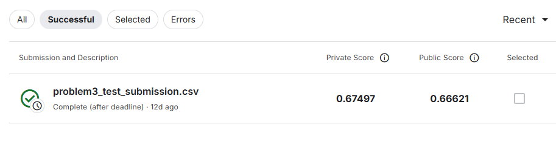

# Credit Risk Learning

## Overview
This project explores credit risk prediction using the [Home Credit Default Risk](https://www.kaggle.com/c/home-credit-default-risk) Kaggle competition dataset. The goal is to build, evaluate, and improve machine learning models for predicting the probability of default.

## Project Structure
```
credit-risk-learning/
│   main.py
│   README.md
│   requirements.txt
│
├───data
│   application_test.csv
│   application_train.csv
│   problem2_baseline_preview.csv
│   problem3_test_submission.csv
│   problem4_feature_engineering_results.csv
│
├───plots
├───reports
│   problem_1_confirmation_report.md
│   kaggle_submission_score.png
│
│───scr
│   problem_1_confirmation.py
│   problem_2_baseline_model.py
│   problem_3_test_estimation.py
│   problem_4_feature_engineering.py 
```

## Setup & Installation
1. Clone this repository.
2. Install dependencies:
```bash
   pip install -r requirements.txt
```
3. Download the Kaggle dataset and place it in the `data/` directory.

## Usage
Run the scripts in the `scr/` folder for each problem:
- Problem 1: Competition overview and requirements.
- Problem 2: Baseline model training and validation.
- Problem 3: Test data prediction and submission file creation.
- Problem 4: Feature engineering and model improvement.

Example:
```bash
python scr/problem_2_baseline_model.py
```

## Results
-----------

## Problem 1: Competition Confirmation
Full report available in [reports/problem_1_confirmation_report.md](reports/problem_1_confirmation_report.md)

-----------

## Problem 2: Baseline Model Learning
Baseline Random Forest model AUC (validation): 0.6950

Preview of first 10 predictions:

|        |   SK_ID_CURR |   TARGET_PRED_PROB |
|--------|--------------|--------------------|
| 245895 |       384575 |               0.38 |
|  98194 |       214010 |               0.16 |
|  36463 |       142232 |               0.12 |
| 249923 |       389171 |               0    |
| 158389 |       283617 |               0.1  |
| 226343 |       362171 |               0.14 |
|  69571 |       180689 |               0.1  |
| 181469 |       310328 |               0.16 |
| 114736 |       233043 |               0.02 |
| 114007 |       232220 |               0.02 |

-----------

## Problem 3: Test Data Estimation and Kaggle Submission

### Kaggle Submission Score
**Public Leaderboard Score**: View screenshot at [reports/kaggle_submission_score.png](reports/kaggle_submission_score.png)



*Note: If the image does not load, the Kaggle submission file `problem3_test_submission.csv` was successfully uploaded to the competition leaderboard. The submission contains predictions for all test data samples.*

### Preview of first 10 predictions for submission:

|    |   SK_ID_CURR |   TARGET |
|----|--------------|----------|
|  0 |       100001 |     0.04 |
|  1 |       100005 |     0.14 |
|  2 |       100013 |     0.04 |
|  3 |       100028 |     0.04 |
|  4 |       100038 |     0.1  |
|  5 |       100042 |     0.1  |
|  6 |       100057 |     0.08 |
|  7 |       100065 |     0.1  |
|  8 |       100066 |     0.06 |
|  9 |       100067 |     0.12 |

------------
------------


## Problem 4: Advanced Feature Engineering (IMPROVED)

### Overview
This improved solution incorporates features from multiple auxiliary datasets:
- Bureau credit history
- Previous Home Credit applications
- Installment payment history
- Credit card balance history
- POS and cash loan history

### Results Summary
Trained and evaluated 10 different feature engineering patterns using LightGBM:

| Pattern             |   Features |   AUC_Score |
|---------------------|------------|-------------|
| P10_All_Features    |        231 |      0.785  |
| P9_PrevApp_Inst_POS |        186 |      0.7809 |
| P8_Bureau_Inst_CC   |        192 |      0.7805 |
| P7_Bureau_PrevApp   |        180 |      0.7768 |
| P5_Installments     |        147 |      0.7749 |
| P4_Previous_App     |        158 |      0.7744 |
| P3_Bureau           |        154 |      0.7723 |
| P6_Credit_Card      |        155 |      0.7702 |
| P2_Domain_Features  |        132 |      0.7678 |
| P1_Baseline         |        120 |      0.7608 |

### Key Findings
- **Best Pattern**: P10_All_Features with **231 features**
- **Best AUC Score**: **0.7850**
- **Improvement over baseline**: **+0.0242** (3.18%)

### Feature Engineering Techniques Used
1. Aggregated statistics from auxiliary tables (mean, max, min, sum, count)
2. Domain-specific financial ratios (income/credit, credit utilization)
3. Time-based features (age, employment duration, payment delays)
4. Behavioral features (late payments, document submission counts)
5. External score combinations and interactions

Full results available in [data/problem4_improved_results.csv](data/problem4_improved_results.csv)


## References
- [Home Credit Default Risk Kaggle Competition](https://www.kaggle.com/c/home-credit-default-risk)
- See reports/ for detailed problem reports.

-----------

## License
This project is for educational purposes.

-----------

## Author

**Assignment:** Credit Risk Learing

**Name:** Victor Karisa

**Date:** 04/10/2025 

-----------